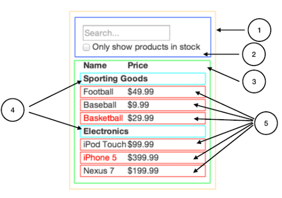

## 1. UI 컴포넌트 계층 구조 나누기

가장 먼저 디자인 시안을 보면서 컴포넌트를 나누어야 한다. 컴포넌트를 나눌때는 ***단일 책임 원칙***을 고려한다. 하나의 컴포넌트는 한 가지 일을 하도록 설계하자!!

## 2. React로 정적인 버전 만들기

컴포넌트를 나누고 나면 UI 렌더링만 되고 동작은 없는 버전을 먼저 만들어 보자. 데이터 모델을 렌더링하는 정적 버전을 만들고 props를 이용해서 데이터를 전달한다. ***정적 버전을 만들기 위해서 state를 사용하지 말자!! state는 오직 상호작용을 위해.. 데이터가 바뀌는 것에 사용한다.***

앱을 만들때는 top-down 또는 bottom-up 방식으로 만들 수 있다. 간단한 프로젝트는 top-down으로 만드는 것이 쉽고, 프로젝트가 클 경우 bottom-up으로 진행하는 것이 더 쉽다.

## 3. UI state 찾아내기

앱에서 필요로 하는 변경 가능한 state의 최소 집합을 생각해 보자. ***핵심은 중복배제 원칙이다.***
최소한의 state를 찾아야 한다. 각 data가 state인지 결정할 경우 고려할 사항은 세 가지다.
- 부모로부터 props를 통해 전달되는가?
- 시간이 지나도 변하지 않는가?
- 컴포넌트 내부의 다른 state나 props를 통해 계산 가능한가?

## 4. State가 위치해야 할 곳

최소한의 state를 찾아낸 다음은 어떤 컴포넌트가 state를 소유할지 찾아야 한다. state를 가질 컴포넌트를 결정할 때는 다음 과정을 따라보자.
1. state를 기반으로 렌더링하는 모든 컴포넌트를 찾는다.
2. state를 공동으로 소유해야하는 컴포넌트를 찾는다.
3. 공동으로 소유해야하는 컴포넌트들의 상위 컴포넌트에 state를 위치시킨다.
4. 적절한 컴포넌트를 찾지 못하였다면, state를 소유하는 상위 컴포넌트를 추가한다.

## 5. 역방향 데이터 흐름 추가하기

마지막으로 각 컴포넌트의 이벤트 처리를 통해 state 값을 업데이트 한다.

## 마치며..

리액트 공식 홈페이지에서 DOC > 주요개념을 읽어봤다. 개념에 관한 이야기라 좀 어렵게 다가오기도 했고, class 타입의 예제코드라 좀 피로감이 느껴졌다. 얼른 Hook을 정리해야겠다. 그리고 Hook에서는 예제코드를 직접 만들어봐야겠다.